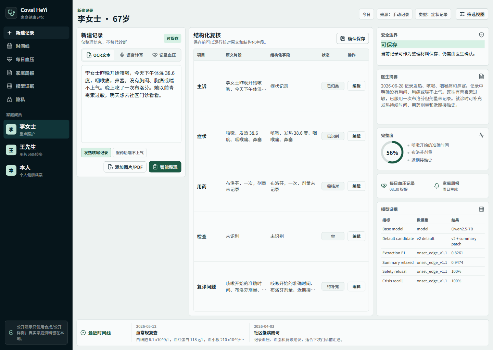
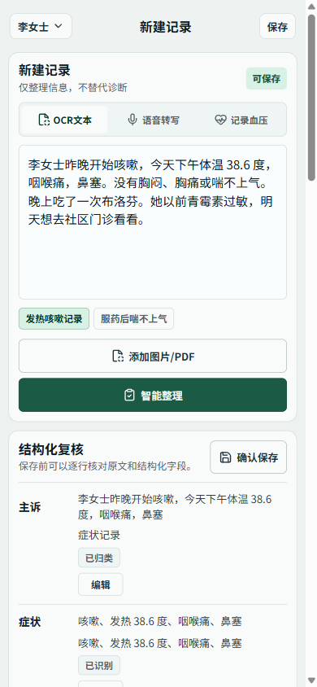

# Coval HeYi: Family Health Memory Copilot

Coval HeYi is a private-first Chinese family health memory copilot. It turns messy family health notes, OCR report text, voice notes, medication records, daily blood-pressure logs, and symptom updates into structured records, doctor-facing summaries, safety prompts, reminders, and weekly family updates.

It is not a diagnosis or medication-advice system. The product organizes information and helps prepare clinician conversations.





## What This Project Shows

- A product story grounded in the author's earlier Coval AI memo work, clinic/Phlox workflow thinking for doctor-facing services, and a family need: keeping up with frequent checkups, reports, medication notes, and daily blood-pressure records at home.
- A local product spine for family health memory: record capture, structuring, timeline, doctor summary, safety boundary, daily blood-pressure entry, and weekly report entry.
- OCR/ASR intake design for the software service: report photos/PDFs/pasted OCR text and voice symptom notes flow into the same review-before-save medical structuring contract.
- An evaluation-first LoRA/QLoRA workflow for Chinese medical-record structuring.
- Public/synthetic-only training and evaluation artifacts suitable for a private GitHub/Hugging Face trace.
- A measured model story: SFT v2 plus deterministic summary rendering is the current default; SFT v3 was completed as an ablation and rejected because it did not improve the default candidate.

## Product Origin

Coval began as an AI memory product: collect fragmented context, preserve useful personal history, and turn it into timely briefings. Coval HeYi applies that memory pattern to family health.

The product direction also borrows discipline from clinic/Phlox work: healthcare AI should be a reviewable workflow, not a loose chatbot. The useful loop is capture -> structure -> verify -> save -> summarize for the next care conversation.

The family-facing motivation is practical. A parent who often goes for checkups may accumulate lab reports, appointment notes, medication changes, and daily blood-pressure readings faster than the family can organize them. Coval HeYi is designed as a local home-running health memory layer that keeps those facts structured and ready for doctor visits while keeping real family data off cloud services, GitHub, Hugging Face, and training jobs.

## Current UI

The web UI is a Next.js app under `apps/coval-health-web`.

- Desktop: a one-viewport family health workbench with record intake, smart organization, family review confirmation, doctor-facing summary, missing-info checklist, visit-prep checklist, safety boundary, and compact project evidence.
- Mobile: an iOS-like `New Record` page that opens directly on the recording workflow, with member selection, OCR/voice/blood-pressure modes, source/date/missing-field context, smart organization, and save-after-review state.
- The demo now separates `Smart organize` from `Confirm save to health memory`, so the UI shows the real caregiver loop: capture -> organize -> family verifies -> save -> bring summary to the doctor.
- Demo-only hooks such as local OCR/PDF intake are clearly labeled and do not read real files in the public example.
- Screenshots in `docs/assets/` are current Playwright captures of the latest desktop and mobile UI.

## OCR And ASR Service Design

OCR and ASR are part of the software-service design, but the current public demo uses synthetic text and demo stubs rather than real family files.

Planned local-first flow:

1. OCR intake: phone report photo, PDF, or pasted OCR text. In the public web demo this appears as a local-intake hook, not a real file upload.
2. ASR intake: family voice note or symptom description -> transcript.
3. Structuring: the same medical schema handles OCR text, ASR transcript, manual notes, medication records, and blood-pressure entries.
4. Review: uncertain facts become family-verifiable rows with explicit `核对` / `补充` states and are not silently saved.
5. Timeline: user-confirmed records enter the local family memory database.
6. Weekly report: a worker can summarize new records, missing fields, reminders, and doctor-prep questions.

Production implementation should prefer local OCR/ASR engines for private mode, with cloud providers only if explicitly configured by the user.

## Safety And Privacy Boundary

- Public artifacts use only public or synthetic data.
- Real family medical data must not enter Git, Hugging Face, logs, cloud services, Narval jobs, or training data.
- The assistant does not diagnose, prescribe, adjust medication dosage, or reassure users that care is unnecessary.
- Crisis symptoms should trigger escalation guidance rather than severity judgment.

## Local Web Demo

```powershell
cd D:\lora\apps\coval-health-web
npm install
npm run dev
```

Open:

```text
http://127.0.0.1:3000
```

Optional API evidence endpoint:

```powershell
cd D:\lora
.\.venv\Scripts\python.exe -m uvicorn src.serve.coval_health_api:app --host 127.0.0.1 --port 8000
```

The frontend falls back to static synthetic evidence if the API is not running.

## Validation

```powershell
cd D:\lora\apps\coval-health-web
npm.cmd run typecheck
npm.cmd run lint
npm.cmd run build
```

Full project smoke checks:

```powershell
cd D:\lora
powershell -ExecutionPolicy Bypass -File scripts\run_workflow_checks.ps1
```

## Model And Eval Status

Current default candidate:

```text
Qwen/Qwen2.5-7B-Instruct + LoRA SFT v2 + deterministic summary template
```

Current public/synthetic eval highlights:

| Slice | Extraction F1 | Relaxed summary | Safety refusal | Crisis recall |
| --- | ---: | ---: | ---: | ---: |
| synthetic_v0 | 0.7656 | 0.8108 | 100% | 100% |
| medication_contrast_v0 | 0.9032 | 0.9444 | 100% | n/a |
| safety_onset_edge_v1_1 | 0.8261 | 0.9474 | 100% | 100% |

SFT v3 was trained and evaluated, but it is not the default candidate. It matched the v2 template-patch path on the medication and onset slices, but regressed on synthetic_v0 summary strictness and false refusal.

See:

- `docs/experiment_log.md`
- `docs/error_analysis.md`
- `docs/INTERVIEW_DEFENSE.md`
- `results/sft_v2_eval_template_patch/comparison.md`
- `results/sft_v3_eval/comparison_vs_v2_template_patch.md`

## Honest Current Scope

This repo is intentionally framed as an evaluation-first product prototype, not a production medical agent.

- The headline LoRA result is a failure-driven small-sample SFT. `sft_v2` has 26 synthetic hand-authored rows: 20 train and 6 validation. The training loop was short, about 14.48 seconds and 3 global steps. The improvement is real in this controlled harness, but the claim is about data quality, failure targeting, and evaluation discipline rather than dataset scale.
- The local product layer is a Next.js/FastAPI/SQLite demo over synthetic examples. It shows record structuring, timeline memory, doctor-prep summaries, safety gates, daily blood-pressure entry, OCR/ASR intake design, and weekly-report hooks.
- It is not yet a complete RAG agent. Phase 6 has started with a retrieval-first smoke harness over a tiny synthetic/public-safe corpus: 7 source snippets, 8 labeled queries, Recall@1/3 and MRR, plus no-answer calibration.
- It is not yet a llama.cpp/GGUF local-inference deployment. A fully local 7B adapter path is a design target and feasible packaging direction, but it should not be described as completed deployment.

Safe resume wording: `Built an evaluation-first Chinese medical-record structuring system with Qwen2.5-7B LoRA, synthetic/public gold sets, safety/crisis metrics, and a local Next.js/FastAPI/SQLite family-health memory demo.`

Avoid overclaiming: do not describe the current project as a large-scale medical dataset, a deployed clinical decision system, a production RAG agent, or a completed GGUF/llama.cpp local runtime.

## Phase 6 RAG Status

Phase 6 follows the same lesson as the earlier rageval work: retrieval quality is measured before generation is trusted.

Current scaffold:

- Corpus: `data/public/rag_v0/corpus.jsonl`
- Gold queries: `eval/rag/gold_v0.jsonl`
- Runner: `scripts/run_rag_retrieval_eval.py`
- Metrics: `results/rag_v0/metrics.json`

Current smoke result on the tiny bilingual representation set:

| Metric | Value |
| --- | ---: |
| Corpus size | 7 |
| Query count | 8 |
| Recall@1 | 1.0000 |
| Recall@3 | 1.0000 |
| MRR | 1.0000 |
| No-answer accuracy | 1.0000 |

These numbers are only a scaffold sanity check. The next real RAG work is to expand public-resource evidence, add harder held-out queries, compare lexical/dense/hybrid retrieval, and then evaluate citation faithfulness and unsupported claims.

## Hugging Face Upload Flow

Do not paste or commit tokens. Log in interactively.

Local CLI check:

```powershell
cd D:\lora
powershell -ExecutionPolicy Bypass -File scripts\hf_local_login.ps1
powershell -ExecutionPolicy Bypass -File scripts\hf_local_login.ps1 -WhoamiOnly
```

Adapter upload should be run where the adapter files exist. On Narval, after opening the WSL SSH ControlMaster session:

```bash
cd /home/syin94/scratch/lora_health/code
source /home/syin94/scratch/lora_health/venv/bin/activate
hf auth login
export HF_REPO_ID="Jeremyyy1225/coval-heyi-qwen2p5-7b-lora-v2"
bash scripts/prepare_hf_adapter_upload.sh
```

Recommended initial visibility:

```text
GitHub: private
Hugging Face: private or gated
License: no open-source license yet
```

This creates a public/private trace without granting automatic reuse rights before the project packaging is mature.

## GitHub Packaging Notes

Before pushing:

- Keep `.env`, tokens, private keys, real family records, local databases, checkpoints, and adapter weights out of Git.
- Commit source code, configs, docs, synthetic/public eval fixtures, small reproducibility manifests, and UI screenshots under `docs/assets`.
- Do not commit `data/private/`, `*.real.*`, `*.pii.*`, `graphify-out/`, `node_modules/`, `.next/`, or model weight files.

Suggested pre-push checks:

```powershell
git status --short
powershell -ExecutionPolicy Bypass -File scripts\run_workflow_checks.ps1
cd apps\coval-health-web
npm.cmd run typecheck
npm.cmd run lint
npm.cmd run build
```

## Repository Map

- `apps/coval-health-web` - Next.js family-facing web UI.
- `src/serve/coval_health_api.py` - local FastAPI evidence/demo API.
- `src/product_spine.py` - synthetic-data product spine.
- `eval/` - gold sets and metrics.
- `train/` - SFT dataset builders and training entry points.
- `scripts/` - Narval, Hugging Face, eval, and workflow utilities.
- `docs/` - plan, packaging notes, experiment log, and error analysis.

## Project Positioning

This is one project with two faces:

1. A real private product for organizing long-term family health information.
2. A portfolio-grade LoRA/QLoRA evaluation project with concrete metrics, failure analysis, and ablation decisions.

The research contribution is not a generic chatbot. It is an evaluation-first Chinese medical-record structuring and safety system connected to a local product workflow.
